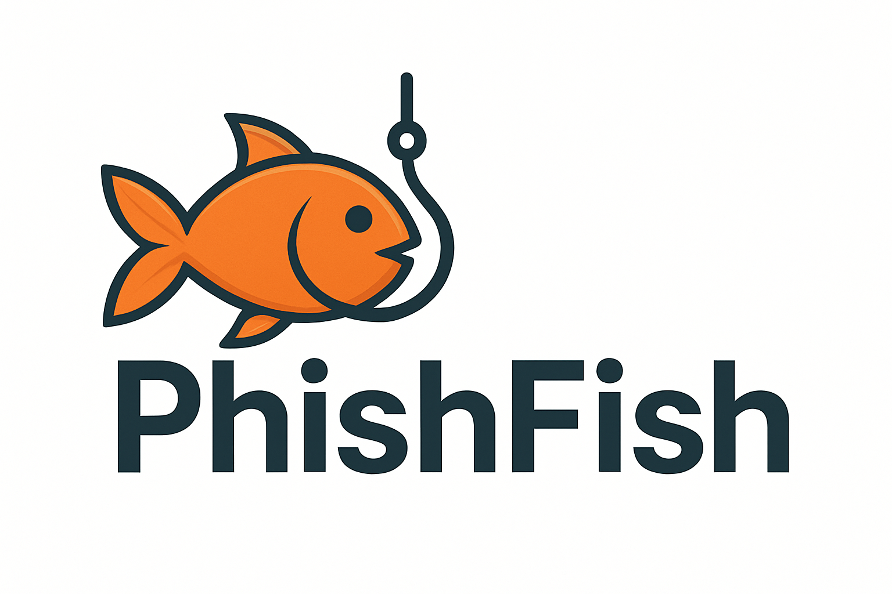

# PhishFish

<p align="center">
  
</p>

**Self-hosted AI-powered email phishing protection**

PhishFish monitors your email in real-time and uses free access to the GitHub models API to detect phishing emails. When a phishing email is detected, PhishFish can either send a notifcation to your phone or move it to a different folder (or both!).

## 🚀 Quick Start with Docker

### Prerequisites
- Docker installed
- Email account with IMAP access
- GitHub token for AI models
- [ntfy.sh](https://ntfy.sh) topic for notifications, if desired

### Setup and Run
```bash
# 1. Create project directory
mkdir phishfish && cd phishfish

# 2. Download configuration template
curl -o .env https://raw.githubusercontent.com/Hamster45105/phishfish/main/.env.example

# 3. Configure your settings
nano .env 

# 4. Run
docker run -d \
  --name phishfish \
  --restart unless-stopped \
  --env-file .env \
  -v $(pwd)/.data:/usr/src/app/.data \
  ghcr.io/hamster45105/phishfish:latest
```

[Configuring your .env file](docs/CONFIGURATION.md) • [Changelog](CHANGELOG.md)

### Updating

```bash
# 1. Stop and remove old container
docker stop phishfish
docker rm phishfish

# 2. Pull new image
docker pull ghcr.io/hamster45105/phishfish:latest

# 3. Re-run
docker run -d \
  --name phishfish \
  --restart unless-stopped \
  --env-file .env \
  -v $(pwd)/.data:/usr/src/app/.data \
  ghcr.io/hamster45105/phishfish:latest
```

### View Logs
```bash
# Follow container logs
docker logs -f phishfish
```

## Example Notification
```
SENDER: "security@amaz0n.com"

SUBJECT: "Urgent: Verify Your Account"

CLASSIFICATION: 🔴 phishing

REASON: Suspicious sender domain and urgent language typical of phishing attempts.

ADVICE: Ignore the email, delete it, or do not click any links.
```
